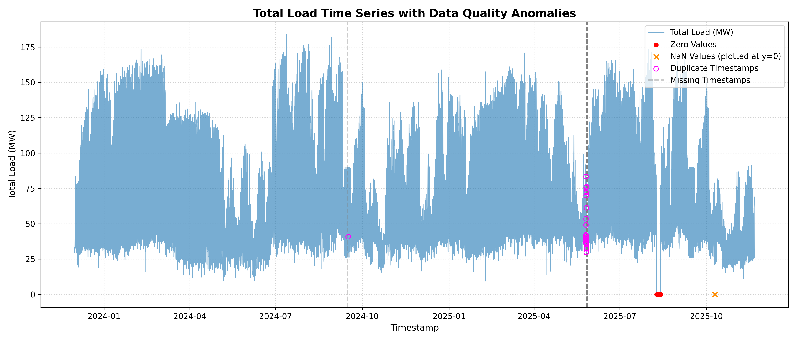
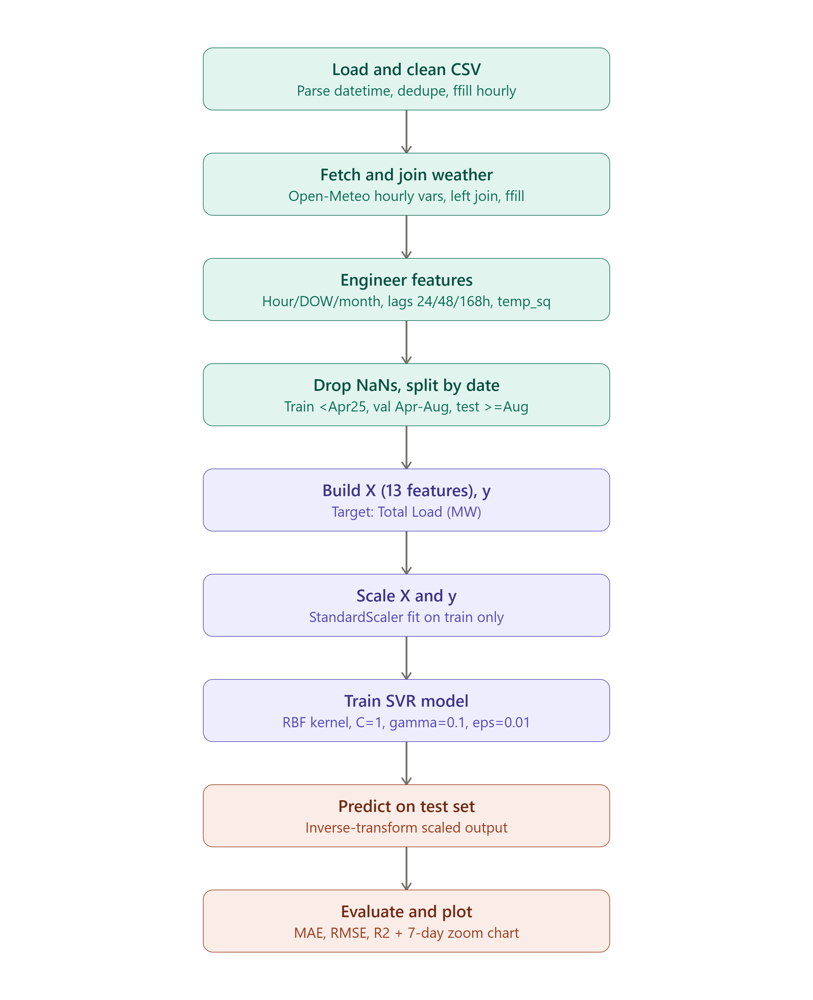
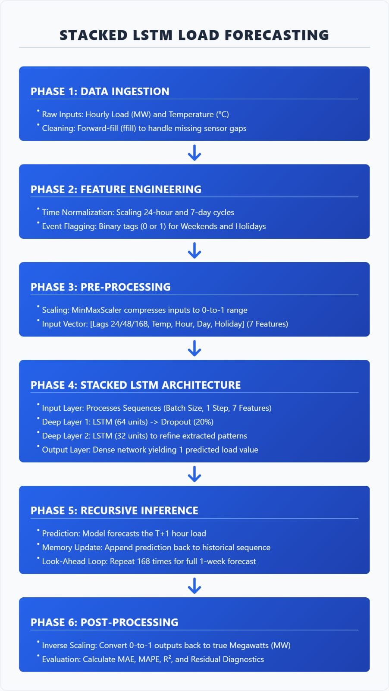
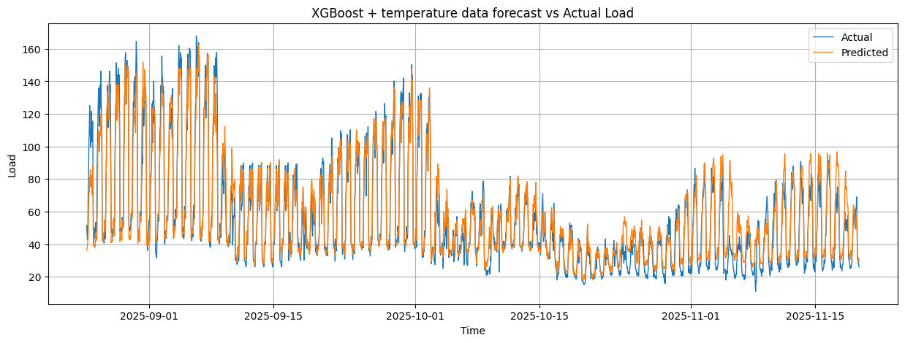
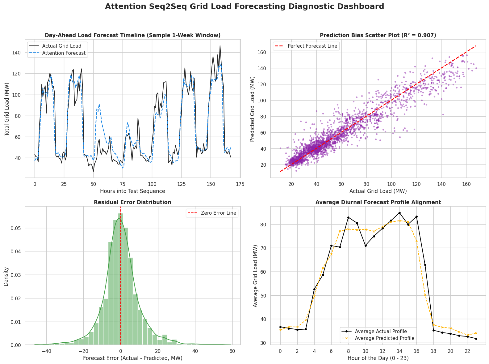

# ⚡ Substation Load Forecasting — 220kV Kuppam

**Day-ahead hourly electricity demand forecasting, benchmarked across five modeling paradigms — from SARIMA to attention-based Seq2Seq LSTMs.**

[](https://www.python.org/)
[](https://jupyter.org/)
[](https://www.tensorflow.org/)
[](LICENSE)

---

## Overview

Utilities need accurate day-ahead load forecasts to schedule generation, manage procurement, and keep the grid stable. This project builds and rigorously compares five forecasting approaches on **17,304 hours of continuous load data** (Dec 2023 – Nov 2025) from a 220kV substation, enriched with weather and calendar features:

| # | Model | Type |
|---|---|---|
| 1 | SARIMA | Classical statistical baseline |
| 2 | Support Vector Regression (RBF) | Classical ML |
| 3 | XGBoost Regressor | Gradient-boosted trees |
| 4 | Stacked LSTM | Deep learning, recursive inference |
| 5 | Seq2Seq LSTM (± Luong Attention) | Deep learning, encoder–decoder |

Each model is evaluated under both a **univariate** setup (load history only) and a **multivariate** setup (load + weather + calendar), on a strict chronological train/validation/test split — no shuffling, no leakage.

**Headline result:** a univariate Seq2Seq LSTM with Luong attention generalizes best across the full 24-hour horizon (R² = 0.929, MAE = 6.56 MW), beating every multivariate variant tested — a counterintuitive finding that shapes several of the design recommendations below.

---

## Table of Contents

- [Dataset](#dataset)
- [Feature Engineering](#feature-engineering)
- [Repository Structure](#repository-structure)
- [Models & Results](#models--results)
- [Key Findings](#key-findings)
- [Visuals](#visuals)
- [Getting Started](#getting-started)
- [Tech Stack](#tech-stack)
- [Future Work](#future-work)
- [Reports](#reports)
- [License](#license)

---

## Dataset

- **Source:** Hourly total load (MW) at a 220kV substation, Dec 1, 2023 – Nov 20, 2025 (17,304 hourly records).
- **Data quality issues found & handled:** 25 duplicate timestamps (50 rows), 103 zero-load readings, 2 missing values — reindexed to strict hourly frequency (`asfreq('1H')`) and imputed via linear interpolation + forward/backward fill.
- **Exogenous data:** historical hourly weather (temperature, relative humidity, cloud cover, rain flag) for the substation's coordinates, pulled from the [Open-Meteo Archive API](https://open-meteo.com/) and left-joined on timestamp.
- **Splits:** chronological — train `< Apr 2025`, validation `Apr–Aug 2025`, test `≥ Aug 2025`, plus a held-out blind 1-week horizon for recursive-inference evaluation.

## Feature Engineering

- **Lags:** `1h, 12h, 24h, 48h, 168h` (hourly through weekly dependencies) + 24-hour rolling mean/std.
- **Calendar:** cyclical sine/cosine encodings of hour-of-day and day-of-week, month, Indian public holiday flag.
- **Weather:** temperature, relative humidity, cloud cover, rain flag.
- **Strongest individual predictors** (by correlation & mutual information): `hour_cos` (corr = −0.618, MI = 0.348) and `relative_humidity_2m` (corr = −0.463) — kept across all model families.

---

## Repository Structure

```
├── data/
│   └── Hourly_Data_220kV.xlsx
├── notebooks/
│   ├── 01_EDA_and_Data_Cleaning.ipynb
│   ├── 02_SARIMA_Baseline.ipynb
│   ├── 03_SVR_Model.ipynb
│   ├── 04_XGBoost_Model.ipynb
│   ├── 05_Stacked_LSTM_Model.ipynb
│   ├── 06_Seq2Seq_LSTM_NoAttention.ipynb
│   └── 07_Seq2Seq_LSTM_Attention.ipynb
├── reports/
│   ├── project_report.pdf              # Full write-up (methodology, results, references)
│   ├── codebase_analysis_report.pdf    # Detailed model/architecture audit
│   └── seq2seq_ablation_analysis.pdf   # Cell-by-cell Seq2Seq feature ablation study
├── assets/
│   └── images/                         # Plots referenced in this README
├── requirements.txt
└── README.md
```

## Models & Results

Ranked by full-horizon test R² on the chronological holdout set:

| Model | Configuration | Exogenous Features | Test MAE | Test R² |
|---|---|---|---|---|
| **Seq2Seq LSTM** | Univariate, Luong Attention | None | **6.56 MW** | **0.929** |
| Seq2Seq LSTM | Univariate, Standard Enc–Dec | None | 6.61 MW | 0.924 |
| XGBoost | max_depth=10, +lag_12 | Weather + Cyclical | 6.87 MW | 0.910 |
| Stacked LSTM | Recursive inference (blind 1-wk) | Weather + Holidays | 6.53 MW | 0.817 |
| XGBoost | max_depth=10, +lag_12 | None | 8.26 MW | 0.853 |
| Seq2Seq LSTM | Multivariate (5 feat, Attention) | Weather + Lags + Calendar | 10.01 MW | 0.794 |
| SVR | RBF kernel, C=50 | None | 9.44 MW | 0.834 |
| SVR | RBF kernel, C=50 | Weather | 10.24 MW | 0.780 |
| SARIMA | (2,1,2)(1,1,0)₂₄ | None | — | 0.873¹ |

¹ SARIMA R² from the seasonal-baseline validation study; see `reports/project_report.pdf` for full ARIMA vs. SARIMA comparison.

<details>
<summary><strong>Full Seq2Seq feature-ablation table (click to expand)</strong></summary>

| Feature Set | Attention | Mean MAE | Overall R² | Overfitting Ratio |
|---|---|---|---|---|
| 1 feature (univariate) | Yes | 7.94 MW | 0.871 | 0.83 (stable) |
| 1 feature (univariate) | No | 8.10 MW | 0.873 | 0.96 (stable) |
| 5 features (+ cyclical time) | Yes | 10.01 MW | 0.794 | 1.70 |
| 5 features (+ cyclical time) | No | 10.26 MW | 0.793 | 2.13 |
| 7 features (+ weather) | Yes | 10.85 MW | 0.771 | 4.24 (severe) |
| 7 features (+ weather) | No | 11.35 MW | 0.769 | 3.79 (severe) |
| 8 features (+ lags 24/48/168h) | Yes | 10.04 MW | 0.792 | 2.49 |
| 8 features (+ lags 24/48/168h) | No | 12.03 MW | 0.704 | 4.71 (extreme) |
| 14 features (full set) | Yes | 11.52 MW | 0.728 | 4.15 (severe) |
| 14 features (full set) | No | 11.58 MW | 0.742 | 5.87 (extreme) |

Full cell-by-cell audit in `reports/seq2seq_ablation_analysis.pdf`.
</details>

---

## Key Findings

- **More features ≠ better generalization.** Every multivariate Seq2Seq variant underperformed the plain univariate model — adding weather/calendar directly to the encoder increased overfitting faster than it added signal (R² dropped from 0.929 → 0.794 with just 5 extra features).
- **Attention rescues lag-heavy inputs.** Without attention, adding 24h/48h/168h lags degraded MAE to 12.03 MW; with attention, it recovered to 10.04 MW — the attention mechanism lets the decoder align directly with distant lagged states instead of relying on a single bottleneck vector.
- **Weather hurts when it's stale.** Feeding *historical* weather into the encoder (rather than *forecast* weather at the decoder step) consistently increased overfitting across both SVR and Seq2Seq — motivating a "future-guided decoder" as the natural next architecture (see [Future Work](#future-work)).
- **Model choice should follow forecast horizon.** Tree-based models (XGBoost) are cheap and effective for single-step (t+1) forecasts; attention-based sequence models generalize better across the full 24-hour horizon, at higher training cost.

---

## Visuals

_Plots go here — reserved slots below, ready for images:_

**Data quality diagnostics** — raw load series with duplicate/missing/zero anomalies flagged


**SVR pipeline** — preprocessing → feature build → scale → train → evaluate
 

**Stacked LSTM pipeline** — ingestion → feature engineering → scaling → recursive inference
 

**XGBoost forecast vs. actual load** — held-out test period (Aug–Nov 2025)
 

**Attention Seq2Seq diagnostic dashboard** — bias scatter, residual distribution, diurnal profile alignment
 

**5-day forecast comparison** — Attention Seq2Seq vs. actual load vs. naive persistence baseline


---

## Getting Started

```bash
git clone https://github.com/<your-username>/<repo-name>.git
cd <repo-name>
pip install -r requirements.txt
jupyter notebook
```

Notebooks are numbered in suggested read order — start with `01_EDA_and_Data_Cleaning.ipynb`... work up to `07_Seq2Seq_LSTM_Attention.ipynb`

---

## Tech Stack

`pandas` · `numpy` · `scikit-learn` · `xgboost` · `statsmodels` (SARIMA) · `TensorFlow`/`Keras` (LSTM, Seq2Seq, Luong Attention) · `Open-Meteo API` · `Jupyter`

---

## Future Work

- **Future-guided decoder:** feed tomorrow's weather *forecast* and calendar markers directly to the decoder at each step, instead of historical weather into the encoder.
- **Extend attention beyond Seq2Seq:** the lag-alignment benefit attention showed here suggests it's worth testing on the XGBoost/SVR feature sets too.
- **Package into reusable scripts** (`src/`) instead of notebook-only code, with a lightweight CLI for generating a forecast on demand.
- **Experiment tracking** (e.g. MLflow) to track metrics across the full model/feature grid systematically instead of manually in reports.

---

## Reports

- [`reports/project_report.pdf`](reports/project_report.pdf) — full write-up: methodology, dataset, all five models, results, and references.
- [`reports/codebase_analysis_report.pdf`](reports/codebase_analysis_report.pdf) — detailed technical audit of every notebook, architecture, and hyperparameter configuration.
- [`reports/seq2seq_ablation_analysis.pdf`](reports/seq2seq_ablation_analysis.pdf) — cell-by-cell audit of the Seq2Seq feature ablation experiments.

---

## License

This project is licensed under the MIT License — see [LICENSE](LICENSE) for details.
